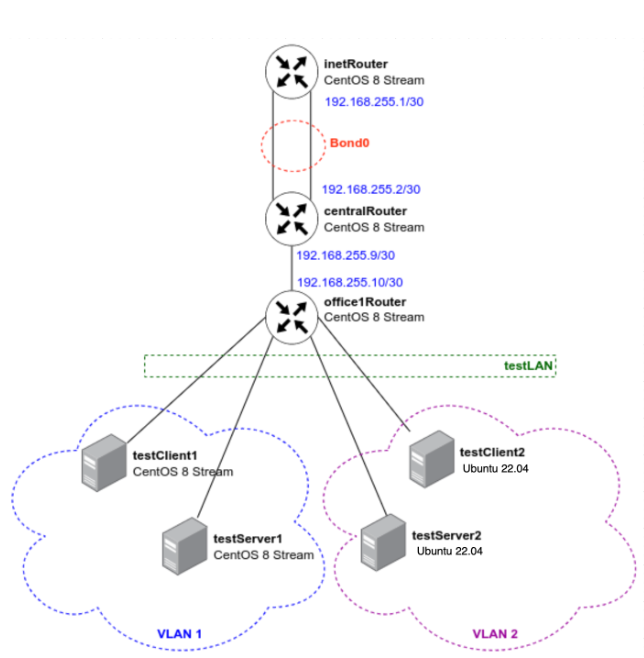

# LACP & VLAN

Топология сети  
  

testClient1 <--> testServer1  
Настроен VLAN c VLAN ID 1

testClient2 <--> testServer2  
Настроен VLAN c VLAN ID 2  

inetRouter <--> centralRouter  
настроен bond  - active-backup 